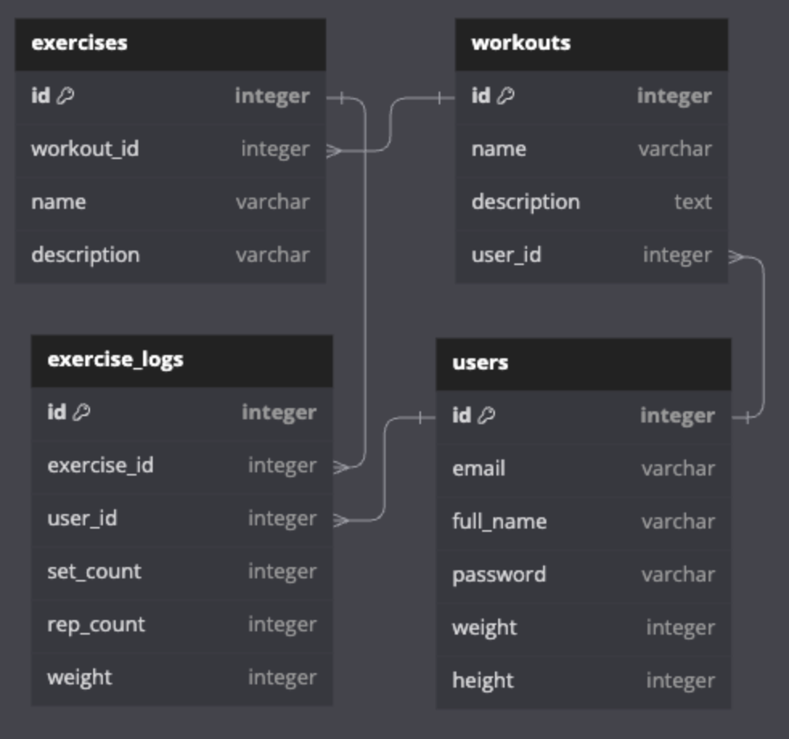

# Graded Challenge 3 - P2

Graded Challenge ini dibuat guna mengevaluasi pembelajaran pada Hacktiv8 Program Fulltime Golang khususnya pada pembelajaran Echo Framework

## Assignment Objectives
Graded Challenge 3 ini dibuat guna mengevaluasi pemahaman SQL sebagai berikut:

- Mampu memahami konsep REST API
- Mampu membuat REST API using Echo Framework
- Mampu membuat REST API dengan implementasi database postgresql
- Mampu menggunakan third-party API
- Mampu implemantasi Autentikasi dan Autorisasi menggunakan JWT pada REST API dengan Echo Framework

## Assignment Directions - Restful API Gym App
You have been tasked with building a RESTful API using Golang Echo and PostgreSQL for a gym app. The API should allow users to create accounts, create workouts, add exercises to those workouts, and log their performance for each exercise. The API should also provide endpoints for retrieving and updating workout and exercise information, as well as deleting workouts and exercises. 

### Requirements:

- Database Requirement
   - Buatlah table sesuai dengan ERD yang telah disediakan, improvement atau perubahan struktur table diperbolehkan, selama masih dapat memenuhi kebetuhuna requirement fitur.
  - RESTRICTION
    - Pastikan email dan username setiap user harus unik dan tidak boleh ada yang sama antar user
    - Pastikan semua field pada database tidak boleh kosong/null
  - Pastikan untuk menyertakan query DDL dan Query seeding data pada folder project GC ini, buatlah file dengan nama ddl.sql pada root folder (jika ada)
- Web API untuk user harus memiliki beberapa fitur sebagai berikut:
  - POST /api/users/register - Creates a new user account.
    - Request dari endpoint ini harus meliputi nama, email, password, berat badan dan tinggi badan
    - Response dari endpoint ini harus berupa message sukses, dan data user yang berhasil disimpan, jika terdapat kesalahan pada request maka response harus terdiri dari message yang menjelaskan kesalahan pada input request nya.
    - Perlu diperhatikan, untuk tidak mengikutsertakan data sensitif seperti password pada response
  - POST /api/users/login - Login into existing account.
    - Request dari endpoint ini harus meliputi email, password
    - Response dari endpoint ini adalah akses token JWT, jika terdapat kesalahan pada request maka response harus terdiri dari message yang menjelaskan kesalahan pada input request nya.
  - Memerlukan login/autentikasi menggunakan JWT, pastikan untuk mengakses setiap endpoint dibawah, perlu disertakan akses token pada headers dengan key `authorization`, jika akses token jwt tidak terautentikasi, maka web api perlu memberikan response error tidak terautentikasi beserta message yang sesuai.
    - GET /api/users - Get information about the authenticated user.
      - Response dari endpoint ini adalah data user yang sedang login (berdasarkan jwt token)
    - GET /api/workouts - Retrieves a list of all workouts created by the authenticated user.
      - Response dari endpoint ini adalah data workout yang dibuat oleh user yang sedang login (berdasarkan jwt token)
    - GET /api/workouts/:id - Retrieves a specific exercise by ID.
      - Response dari endpoint ini adalah data workout yang dibuat oleh user yang sedang login (berdasarkan jwt token), beserta dengan exercises yang terkait dengan workout tersebut, jika workout dengan ID tidak ditemukan, maka response harus terdiri dari message yang menjelaskan bahwa data workout tidak ditemukan.
    - POST /api/workouts - Creates a new workout for the authenticated user.
      - Request dari endpoint ini adalah nama dan deskripsi workout
      - Response dari endpoint ini harus berupa message sukses, dan data workout yang berhasil disimpan, jika terdapat kesalahan pada request maka response harus terdiri dari message yang menjelaskan kesalahan pada input request nya.
    - PUT /api/workouts/:id - Updates an existing workout.
      - Request dari endpoint ini adalah nama dan deskripsi workout
      - Response dari endpoint ini harus berupa message sukses, dan data workout yang berhasil diperbaharui, jika terdapat kesalahan pada request maka response harus terdiri dari message yang menjelaskan kesalahan pada input request nya.
      - Pastikan hanya owner dari workout yang dapat melakukan aksi ini. Jika user lain selain owner dari workout melakukan aksi ini pastikan untuk membatalkan aksi dan memberikan response error terdiri dari message yang menjelaskan bahwa user tersebut tidak dapat melakukan aksi delete
    - DELETE /api/workouts/:id - Deletes a workout and all exercises associated with it.
      - Response dari endpoint ini adalah data workout sesuai dengan ID pada parameter endpoint dan message yang yang menjelaskan bahwa proses penghapusan data workout berhasil, jika workout dengan ID tidak ditemukan, maka response harus terdiri dari message yang menjelaskan bahwa data workout tidak ditemukan.
      - Pastikan hanya owner dari workout yang dapat melakukan aksi ini. Jika user lain selain owner dari workout melakukan aksi ini pastikan untuk membatalkan aksi dan memberikan response error terdiri dari message yang menjelaskan bahwa user tersebut tidak dapat melakukan aksi delete
    - POST /api/exercises - Creates a new exercise and associates it with a workout.
      - Request dari endpoint ini adalah workout_id, nama, dan deskripsi workout
      - Response dari endpoint ini harus berupa message sukses, dan data workout yang berhasil disimpan, jika terdapat kesalahan pada request maka response harus terdiri dari message yang menjelaskan kesalahan pada input request nya.
      - Pastikan workout(workout_id) adalah milik user yang sedang login(berdasarkan jwt token), jika tidak maka perlu menampilkan pesan error
    - DELETE /api/exercises/:id - Deletes an exercise and all associated exercise logs.
      - Response dari endpoint ini adalah data exercise sesuai dengan ID pada parameter endpoint dan message yang yang menjelaskan bahwa proses penghapusan data exercise berhasil, jika exercise dengan ID tidak ditemukan, maka response harus terdiri dari message yang menjelaskan bahwa data exercise tidak ditemukan.
      - Pastikan hanya owner dari exercise yang dapat melakukan aksi ini. Jika user lain selain owner dari exercise melakukan aksi ini pastikan untuk membatalkan aksi dan memberikan response error terdiri dari message yang menjelaskan bahwa user tersebut tidak dapat melakukan aksi delete
    - POST /api/logs - Create a new exercise log associates with authenticated user and exercise
      - Request dari endpoint ini adalah exercise_id, berat beban, jumlah repetisi, jumlah set, dan tanggal dan waktu logs dibuat
      - Response dari endpoint ini harus berupa message sukses, dan data workout yang berhasil disimpan, jika terdapat kesalahan pada request maka response harus terdiri dari message yang menjelaskan kesalahan pada input request nya.
      - Pastikan exercise(exercise_id) adalah milik user yang sedang login(berdasarkan jwt token), jika tidak maka perlu menampilkan pesan error
    - GET /api/logs - Retreives exercises logs associates with authenticated user
      - Response dari endpoint ini adalah data logs beserta exercise nya, data yang perlu diperoleh adalah data logs milik user yang sedang login (berdasarkan jwt token)
  - Setiap endpoint diatas harus menerapkan best practice REST termasuk status code dan http method yang digunakan
  - Setiap endpoint diatas perlu dibuat dokumentasi API menggunakan Swagger dan dapat diakses pada `/swagger/index.html`
- Requirement 3rd Party API
  - Kembangkanlah endpoint GET /api/users, untuk mendapatkan data Body Mass Index sesuai dengan data user yang sedang login. Hitung Body Mass Index dengan menggunakan 3rd Party API berikut `https://rapidapi.com/principalapis/api/body-mass-index-bmi-calculator` 
- Pastikan untuk mengikuti best practice untuk penggunaan environment variable
- Deployment Requirement
  - Buatlah database pada platform Supabase(postgreSQL) dan sambungkan dengan aplikasi anda.
  - Deploy REST API yang sudah anda buat dengan menggunakan platform Heroku, dan pastikan mencantumkan url hasil deployment pada section expected result dan deployment notes.

## Expected Result
- Web API dapat diakses pada _________ (isi dengan url hasil deployment anda).
- Web API memiliki endpoint sebagai berikut
  - <b>POST</b> /api/users/register
    - request body -> `{ name, email, password, weight, height }`
  - <b>POST</b> /api/users/login 
    - request body -> `{ email, password }`
  - <b>GET</b> /api/users
    - request headers -> `{ authorization }`
  - <b>GET</b> /api/workouts
    - request headers -> `{ authorization }`
  - <b>GET</b> /api/workouts/:id
    - request headers -> `{ authorization }`
  - <b>POST</b> /api/workouts
    - request headers -> `{ authorization }`
    - request body -> `{ name, description }`
  - <b>PUT</b> /api/workouts/:id
    - request headers -> `{ authorization }`
    - request body -> `{ name, description }`
  - <b>DELETE</b> /api/workouts/:id
    - request headers -> `{ authorization }`
  - <b>POST</b> /api/exercises
    - request headers -> `{ authorization }`
    - request body -> `{ workout_id, name, description }`
  - <b>DELETE</b> /api/exercises/:id
    - request headers -> `{ authorization }`
  - <b>POST</b> /api/logs
    - request headers -> `{ authorization }`
    - request body -> `{ exercise_id, weight, repition_count, set_count }`
  - <b>GET</b> /api/logs
    - request headers -> `{ authorization }`

## Assignment Submission
Push Assigment yang telah Anda buat ke akun Github Classroom Anda masing-masing.

### Assignment Notes:
- Jangan terburu-buru dalam menyelesaikan masalah atau mencoba untuk menyelesaikannya sekaligus.
- Jangan menyalin kode dari sumber eksternal tanpa memahami bagaimana kode tersebut bekerja.
- Jangan menentukan nilai secara hardcode atau mengandalkan asumsi yang mungkin tidak berlaku dalam semua kasus.
- Jangan lupa untuk menangani negative case, seperti input yang tidak valid
- Jangan ragu untuk melakukan refaktor kode Anda, buatlah struktur project anda lebih mudah dibaca dan dikembangkan kedepannya, pisahkanlah setiap bagian kode program pada folder sesuai dengan tugasnya masing-masing.

### Additional Notes
Total Points : 100

Deadline : Diinformasikan oleh instruktur saat briefing GC. Keterlambatan pengumpulan tugas mengakibatkan skor GC 3 menjadi 0.

Informasi yang tidak dicantumkan pada file ini harap dipastikan/ditanyakan kembali kepada instruktur. Kesalahan asumsi dari peserta mungkin akan menyebabkan kesalahan pemahaman requirement dan mengakibatkan pengurangan nilai.

### Deployment Notes
Deployed url: _________ (isi dengan url hasil deployment anda)